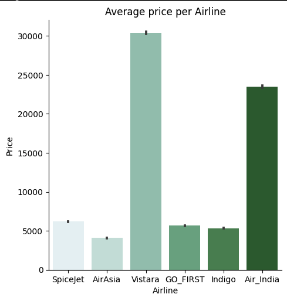
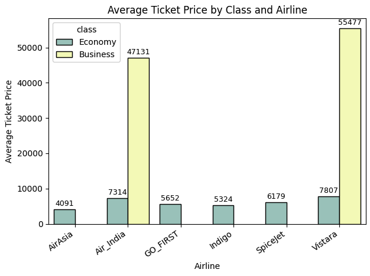
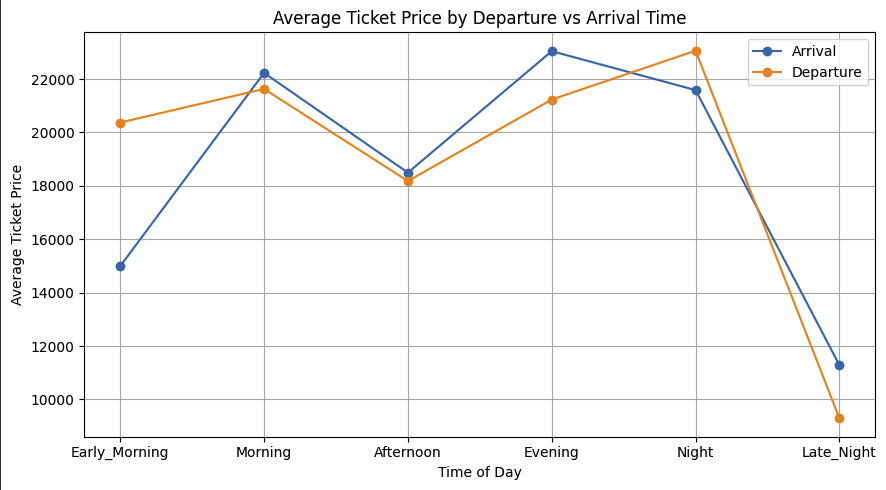
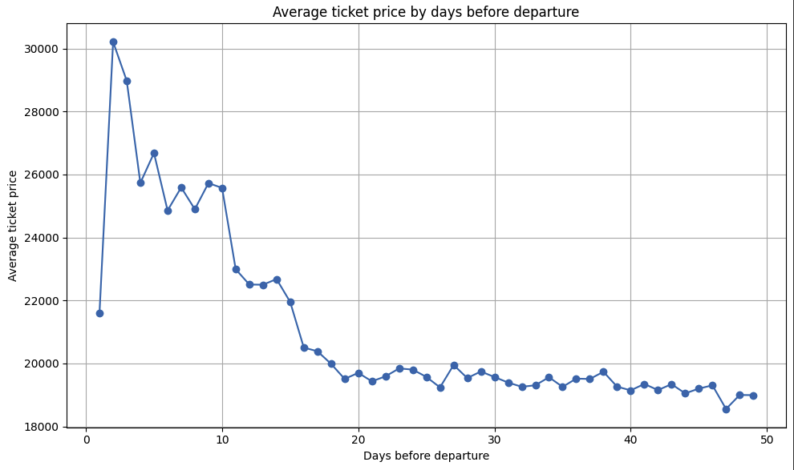
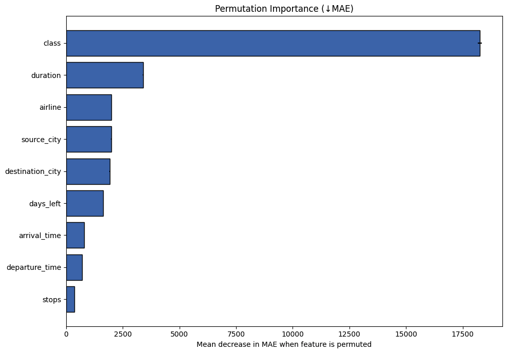

# airline-ticket-price-analysis

### Author: Lucio Nieto
### Date: 8/16/2025
### Contact: Email lucionieto2.0@gmail.com | Linkedin (https://www.linkedin.com/in/lucio-nieto/) 

This project explores an airlines flights dataset and builds a machine learning model to predict ticket prices. The analysis covers how different factors such as airline, source/destination city, travel class, departure/arrival times, and days  before departure impact flight pricing. 

## Project Objective
This project explores  factors such as class, routes, departure/arrival times and how they influence ticket prices. In addition to exploratory data analysis, I built a machine learning model techniques to predict ticket prices and quantify influence of different variables. The goal of the project was to demonstrate analytical and modeling skills that are relevent to real world datasets and pricing problems. 

## Dataset   
**Source** [Airlines Flights Dataset – Kaggle](https://www.kaggle.com/datasets/rohitgrewal/airlines-flights-data)
**Size** ~30,000 rows, 11 Features

## Dataset Description  

The dataset contains information on commercial flight bookings between major Indian cities. Each row represents one flight option, with details about the airline, route, class, timing, and price.  

### Features  

| Column            | Description                                                                 | Type        |
|-------------------|-----------------------------------------------------------------------------|-------------|
| **Airline**       | Carrier operating the flight (6 unique airlines).                           | Categorical |
| **Flight**        | Alphanumeric flight code identifying the specific flight.                   | Categorical |
| **Source City**   | City of departure (6 unique cities).                                        | Categorical |
| **Destination City** | City of arrival (6 unique cities).                                       | Categorical |
| **Departure Time**| Time of departure, grouped into 6 categories (Early Morning, Morning, etc.).| Categorical |
| **Arrival Time**  | Time of arrival, grouped into 6 categories.                                 | Categorical |
| **Stops**         | Number of stops (Non-stop, 1 Stop, 2+ Stops).                               | Categorical |
| **Class**         | Ticket class (Economy or Business).                                         | Categorical |
| **Duration**      | Total travel time in hours.                                                 | Numerical   |
| **Days Left**     | Days between booking date and flight date.                                  | Numerical   |
| **Price**         | Ticket price (target variable).                                             | Numerical   |

## Methodology & Analysis

### Technical Details
- **Languages:** Python
- **Libraries:** NumPy, Pandas, Matplorlib, Seaborn, Scikit-Learn
- **Environment:** Jupyter Notebook

### Techniques Used
- Exlporatory Data Analysis with Pandas, Matplotlib and Seaborn
- Data Preprocessing (encoding categorical variables)
- Model training and Evaluation

## Modeling
Using the **Scikit-Learn** library I trained a **Random Forest Regressor** to predict airline ticket prices.
- Implemented data preprocessing pipelines (`SimpleImputer`, `OneHotEncoder`, `ColumnTransformer`)
- Split dataset using 80% for training and the remaining 20% for testing/evaluation
- Tuned hyperparameters to improve model performance
- Evaluated model acuraccy using **Mean Absolute Error **(MAE)** and **R² score**

## Results
### Average Ticket Price per Airline

#### Average Ticket Price by Airline and Class

###  Ticket Price at Departure and Arrival Times

### Ticket Price in days before departure

### Feature Importance (Permutation)

## Key Insights
- Business class prices are ~7x higher than economy tickets.
- Booking a flight with 10+ days prior to departure significantly decreases average ticket price.
- Late Night Arrivals and departures yield the lowest average ticket price compared to other times.
- Feature Importance of class, duration and airline are the strongest predictors for price. 

## Model Performance
- Mean Absolute Error: 1,064.81
- R²: 0.985
- *RandomForestRegression model explains ~96% of variance in ticket prices.*
